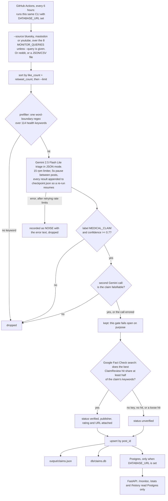

# Checkit Health

Checkit Health is a prototype for monitoring health misinformation on public social platforms. It ranks high-engagement posts, identifies specific medical claims, looks for matching published fact-checks, and provides a dashboard plus a manual claim-checking workflow.

> **Important:** This is an analyst-support and research prototype, not medical advice or an automated truth service. AI-generated classifications and summaries can be wrong. Review any linked, published fact-check and its sources before acting on a claim.

**Live demo:** https://checkit-health-s9p4.vercel.app<br>
**API:** https://checkit-health-api.onrender.com

## What it does

```text
Bluesky / Mastodon / YouTube / Reddit / file
  → engagement ranking → medical keyword filter → Gemini claim triage
  → confidence + falsifiability gates → Google Fact Check lookup
  → Postgres / SQLite / JSON → FastAPI → React monitor and Check view
```

- **Narratives:** the default view. One row per rumor rather than per post,
  with total reach across every platform carrying it, a lifecycle state, and
  how many member posts are still awaiting review.
- **Narrative detail:** the reach curve over time, every member post with
  inline review controls, the evidence attached to the rumor, and the
  counter-message drafts made against it.
- **Posts:** the per-post monitor, ranked by an explainable review priority,
  filterable by topic, source, time window, and engagement tier. Review
  decisions can be recorded inline. **Check claim** sends any row to the
  manual checker.
- **Check:** classify a pasted statement, retrieve medical evidence, show retrieval
  status, and produce a citation-grounded report. The report displays its
  evidence state, linked sources, publication metadata, relevance scores, and
  the exact retrieved passages used by the model.
- **History:** review saved manual checks, assign a human review state, and save
  analyst notes when Postgres is configured. Review mutations can be protected
  with `ANALYST_API_KEY`.
- **Grounded evidence:** retrieve and rank ClaimReview, PubMed, and
  ClinicalTrials.gov results; reports cite the exact returned passages or
  explicitly return insufficient evidence.
- **Analyst governance:** record human review state, notes, reviewer identity,
  and an append-only audit trail.
- **Situation reports:** a per-narrative brief as HTML (print to PDF) or JSON,
  plus CSV exports of the narrative rollup and the current monitor view. Every
  report is stamped with the model, weights, rules, and exact evidence ids that
  produced it, so it can be regenerated identically later.
- **Counter-message drafting:** protocol-structured pre-bunk and debunk drafts,
  gated on evidence and approval. Checkit never publishes; an approved draft is
  exported as text for a person to send.
- **Feedback loop:** the triage score in force when a claim was surfaced is
  persisted alongside the analyst decision that followed, with a randomized
  slice of the queue reserved as an unbiased evaluation sample.

## The narrative ledger

The unit Checkit tracks is a *narrative*: one rumor, followed across platforms
and across time, with the evidence assembled against it, every analyst decision
made about it, and every response drafted from it in one durable record.

```text
posts  →  narrative assignment  →  engagement snapshots  →  lifecycle state
                ↓                          ↓                      ↓
         evidence attached         growth measured        response mode
                ↓                          ↓                      ↓
              situation report  ·  analyst decision  ·  weight retuning
```

Three tables make it work, all append-only:

| Table | Why it exists |
|---|---|
| `narratives` | One row per rumor, with a centroid and lifecycle state |
| `engagement_snapshots` | The claims table upserts on `post_id`, so a re-ingest overwrites likes and reposts. Without an append-only observation log, growth cannot be computed at all. |
| `claim_scores` | The triage score at the moment a claim was surfaced, with the `weights_version` that produced it. This is the dataset a retune is measured against. |

Claims stored before the ledger existed can be folded in retrospectively:

```bash
cd backend
PYTHONPATH=app python scripts/backfill_narratives.py --dry-run
PYTHONPATH=app python scripts/backfill_narratives.py
```

### Grouping quality is disclosed, not assumed

Narrative assignment embeds each claim and merges it into the nearest existing
narrative above a calibrated cosine threshold. The threshold is a property of
the embedding, so it is measured rather than guessed:

```bash
PYTHONPATH=app python scripts/calibrate_threshold.py
```

The sweep runs against 60 hand-labeled claim pairs in
`backend/data/claim_pairs.json`, deliberately including hard negatives that
share most of their vocabulary ("MMR causes autism" against "MMR causes
seizures"), and reports a separation AUC alongside the threshold.

Without `GOOGLE_API_KEY` the retriever falls back to a dependency-free hashed
embedding. **That fallback scores 0.57 AUC on the labeled set, which is barely
better than chance**: surface features cannot tell two claims about the same
subject and different outcomes apart. In that mode the threshold is set where
measured precision was 1.0, so only near-identical wording merges, and both
`GET /meta` and the interface say so. Set `GOOGLE_API_KEY` for semantic
grouping, then re-run the calibration.

## Responding to a narrative

Counter-message drafting exists, and it is constrained in code rather than by
prompt:

1. **Gated on evidence.** Refused unless the narrative's evidence state is
   `contradicted` or `mixed`. A tool that writes rebuttals for claims it has no
   evidence against is a misinformation generator.
2. **Protocol-structured.** The draft fills the slots of the Debunking Handbook
   2020 fact-myth-fallacy structure, or the inoculation structure for
   pre-bunking, as a typed schema.
3. **Citations validated.** Every citation id is checked against the evidence
   actually retrieved; invented ids are dropped and a draft left with none is
   discarded.
4. **Approval gate.** A draft stays `draft` until a named person approves it.
   Only approved drafts can be exported.
5. **No publishing.** There is no OAuth, no scheduler, no send. Export is text.

Mode follows the narrative's lifecycle rather than the caller's preference,
because restating a rumor to an audience that has not seen it spreads it:

| Lifecycle | Mode | Why |
|---|---|---|
| emerging, accelerating | pre-bunk | Inoculate against the technique without naming the claim |
| peaking, watching | debunk | The claim is already widely seen |
| declining, dormant | none | Responding to a fading rumor revives it |

### What changed in the interface

- The default view is the narrative queue: one row per rumor, with reach,
  platform spread, lifecycle state, and how many posts still need review.
- Review priority is rendered with its three components visible, so "why is
  this at the top" is answerable without trusting a single number.
- Review controls appear on the monitor and on each narrative, not only in
  History. Decisions were previously only recordable against the last 50 rows.
- The claim result shows whether evidence retrieval succeeded, how many source
  passages were found, whether the cache was used, and whether any source was
  temporarily unavailable.
- Evidence reports now use the explicit states `supported`, `contradicted`,
  `mixed`, `insufficient`, and `not applicable`.
- Every cited source is shown with a link, publisher, publication date,
  relevance score, and retrieved passage.
- History details include controls for `unreviewed`, `in review`, `accepted`,
  `rejected`, and `needs evidence`, plus an analyst note field.
- Safety, escalation, clustering, evidence quality, and explainable review
  priority remain visible as analyst-support signals.

## How a post becomes a claim

Every stage below can drop a post, and the two model gates are deliberately tuned to
fail in opposite directions.



A classification that errors out is stored as `NOISE` and dropped, while a falsifiability
call that errors returns true and the claim survives; a borderline claim reaching an
analyst is cheaper than silently losing a real one. The keyword-overlap threshold on the
fact-check step is there because Google's ClaimReview search matches loosely, so without
it a claim can pick up an unrelated verdict.

## Quick start

Requirements: Python 3.11+ and a Gemini API key. Node 20+ is needed for the frontend.

```bash
git clone https://github.com/lgoyal6/checkit_health.git
cd checkit_health/backend
python -m venv .venv
source .venv/bin/activate
pip install -r requirements.txt

export GOOGLE_API_KEY=AIza...
export PYTHONPATH=app

# Validate bundled data without making API calls
python scripts/run.py --dry-run --input data/posts.json

# Run the complete pipeline
python scripts/run.py --input data/posts.json --output output/claims.json
```

The bundled sample has 296 posts. The dry run should report 44 keyword-filtered posts and 252 posts queued for classification.

## Run the web app

Start the API from `backend/app` so its flat module imports resolve:

```bash
cd backend/app
../.venv/bin/uvicorn api:app --reload
```

Then start the frontend in another terminal:

```bash
cd frontend
npm ci
npm run dev
```

The frontend defaults to `http://localhost:8000`. Set `VITE_API_URL` in `frontend/.env` to point it elsewhere.

### Optional services

```bash
export GOOGLE_FACT_CHECK_KEY=...       # Enables existing fact-check lookup
export DATABASE_URL=postgresql://...   # Durable production storage
export ANALYST_API_KEY=...             # Protects review and audit endpoints
export EVIDENCE_RETRIEVAL_ENABLED=true
export NARRATIVE_THRESHOLD_MANAGED=0.75  # from scripts/calibrate_threshold.py
export EXPLORATION_RATE=0.10             # share of the queue surfaced at random
export WEIGHTS_VERSION=heuristic-2026-07-23
export RESPONSE_ENABLED=true             # counter-message drafting
export EMBEDDING_MODEL=gemini-embedding-001
export EMBEDDING_DIMENSIONS=768
export BLUESKY_IDENTIFIER=...
export BLUESKY_APP_PASSWORD=...
export MASTODON_ACCESS_TOKEN=...
export MASTODON_INSTANCE_URL=https://mastodon.social
export YOUTUBE_API_KEY=...
```

Without `DATABASE_URL`, the CLI writes SQLite and JSON locally. The Monitor endpoint is intentionally Postgres-only, so it returns no rows in SQLite-only mode.

When `GOOGLE_API_KEY` and `DATABASE_URL` are available, evidence is embedded
with Gemini and stored in a pgvector HNSW index. Without either service, the
retriever falls back safely and never treats a retrieval failure as evidence
that a claim is true or false.

## Project layout

```text
backend/
  app/
    api.py             # FastAPI routes
    narratives.py      # embedding, clustering, growth, lifecycle
    narrative_store.py # narrative / snapshot / score / response persistence
    ledger.py          # one entry point the CLI and API both call
    reporting.py       # CSV exports and the situation report
    response.py        # counter-message drafting and its gates
    tuning.py          # weight fitting against analyst decisions
  scripts/run.py                    # pipeline CLI
  scripts/calibrate_threshold.py    # measure the clustering threshold
  scripts/backfill_narratives.py    # fold existing claims into the ledger
  data/posts.json      # Bundled sample data
  data/claim_pairs.json # Labeled pairs for threshold calibration
  tests/               # API and pipeline unit tests
  requirements.txt
  render.yaml
frontend/
  src/                 # React pages, components, and tests
  package.json
.github/workflows/     # CI, scheduled ingestion, keep-warm
```

## Pipeline and CLI

The pipeline sorts posts by `like_count + retweet_count`, applies a medical-keyword filter, uses Gemini to classify a post as `MEDICAL_CLAIM`, `GENERAL_HEALTH`, or `NOISE`, and retains sufficiently confident, falsifiable medical claims. It searches Google's ClaimReview index for a closely matching published fact-check before persisting the result.

```bash
cd backend
export PYTHONPATH=app

python scripts/run.py --source bluesky --limit 50
python scripts/run.py --source mastodon --query vaccine --mastodon-limit 25
python scripts/run.py --source youtube --query "raw milk" --youtube-limit 25
python scripts/run.py --source reddit --subreddit conspiracy --reddit-limit 50
```

| Flag | Purpose |
|---|---|
| `--input PATH` | Read a JSON or CSV file (default: `data/posts.json`) |
| `--source` | `file`, `reddit`, `bluesky`, `mastodon`, or `youtube` |
| `--query TEXT` | Source search query; defaults to monitor terms |
| `--limit N` | Limit ranked posts before model work |
| `--dry-run` | Validate input and prefilter counts without API calls |
| `--skip-prefilter` | Send every post to Gemini |
| `--skip-fact-check` | Skip Google Fact Check lookup |

## API

| Endpoint | Purpose |
|---|---|
| `GET /health` | Liveness check |
| `GET /health/db` | Non-secret Postgres connectivity diagnostic |
| `POST /check` | Classify one submitted statement |
| `POST /jobs/check` | Queue claim processing and return a status URL |
| `GET /jobs/{job_id}` | Read queued check status/result |
| `POST /report` | Generate an AI analyst summary for a classified claim |
| `GET /history` | Recent saved checks |
| `GET /monitor` | Social claims ranked by reach |
| `GET /stats` | Monitor aggregates |
| `PATCH /claims/{post_id}/review` | Save an analyst decision and audit event |
| `GET /claims/{post_id}/audit` | Read the review audit trail |
| `GET /meta` | Versions, weights, and clustering-quality disclosure |
| `GET /narratives` | Narrative rollup, ranked by reach |
| `GET /narratives/{id}` | Members, evidence, trajectory, and drafts |
| `PATCH /narratives/{id}/status` | Set watching / reviewing / responded / archived / resolved |
| `GET /narratives/{id}/report` | Situation report as `json` or `html` |
| `GET /export/claims.csv` | The current monitor view as CSV |
| `GET /export/narratives.csv` | The narrative rollup as CSV |
| `POST /narratives/{id}/responses` | Draft a counter-message (409 when refused) |
| `PATCH /responses/{id}` | Approve or reject a draft |
| `GET /responses/{id}/text` | Export an approved draft as plain text |
| `GET /tuning/weights` | Compare live weights against ones fitted to analyst decisions |

`/monitor` accepts `window` (`24h`, `7d`, `30d`, or `all`), `topic`, `source`, and `limit`. `/monitor` and `/stats` exclude manual web checks.

`/monitor` and `/stats` remain Postgres-only. The narrative endpoints, exports,
review, and tuning work on SQLite too, so the whole workflow can be run and
demonstrated locally with no cloud services.

## Testing and quality checks

```bash
# Backend
cd backend
export PYTHONPATH=app
pytest
ruff check app scripts tests

# Frontend
cd ../frontend
npm ci
npm run test
npm run build
```

CI runs these checks for pull requests and pushes to both `main` and `dev`. Scheduled ingestion runs every six hours. Bluesky is required; Mastodon and YouTube run when their corresponding repository secrets are configured.

Evidence architecture, configuration, limitations, and evaluation are
documented in [docs/EVIDENCE.md](docs/EVIDENCE.md).

## Deployment

- Deploy `backend/render.yaml` to Render and set its listed secrets.
- Deploy `frontend/` to Vercel and set `VITE_API_URL` to the Render URL.
- Use Supabase Postgres via `DATABASE_URL` for durable production data.

## Data contract

Input posts require `id`, `text`, `timestamp`, `username`, `retweet_count`, and `like_count`. Persisted claims include the original post, extracted claim, topic, confidence, engagement counts, processing time, source, and any matched fact-check publisher, verdict, and URL. Re-runs upsert records by `post_id`.

For the full product, data-source, API, and user-workflow reference, see
[docs/PRODUCT.md](docs/PRODUCT.md).
